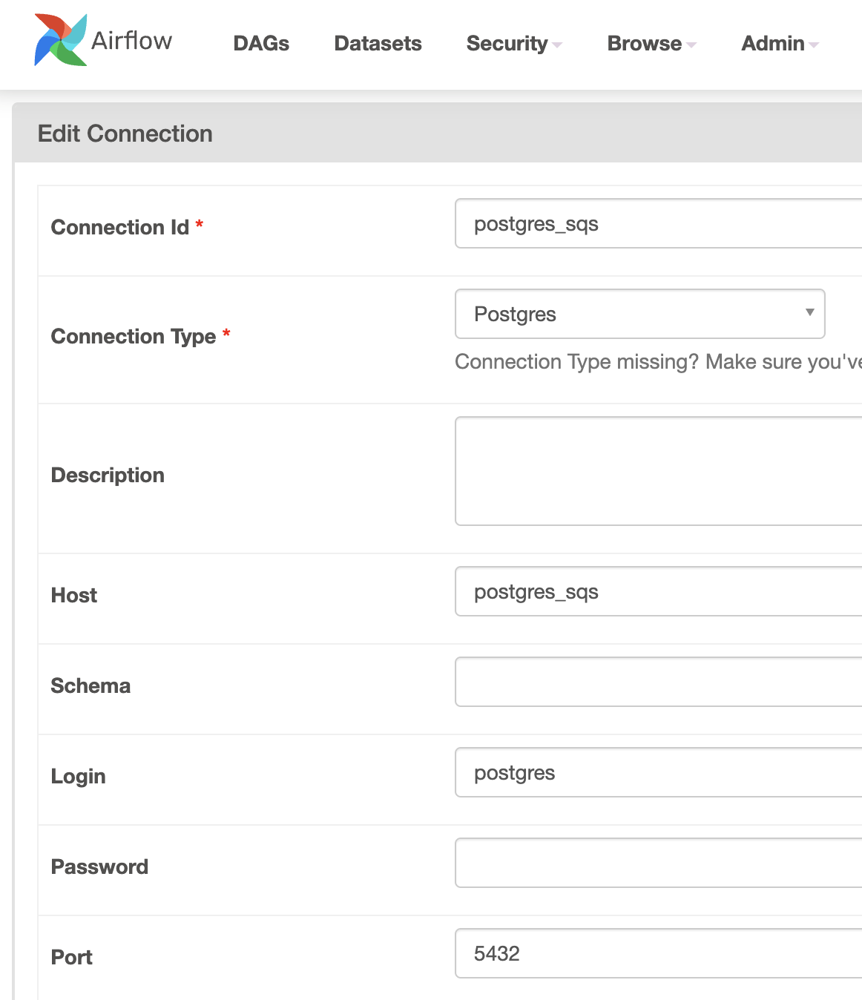
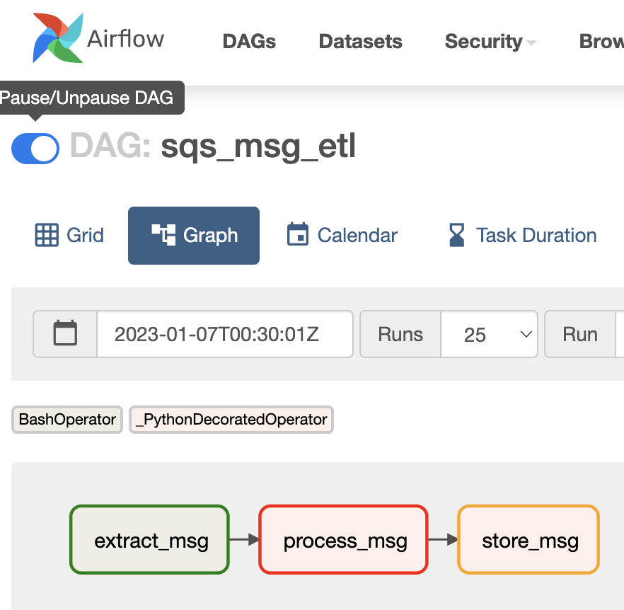
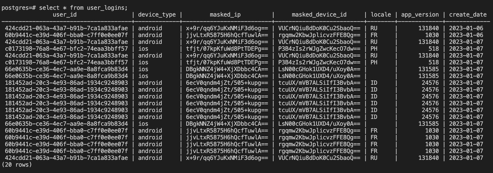
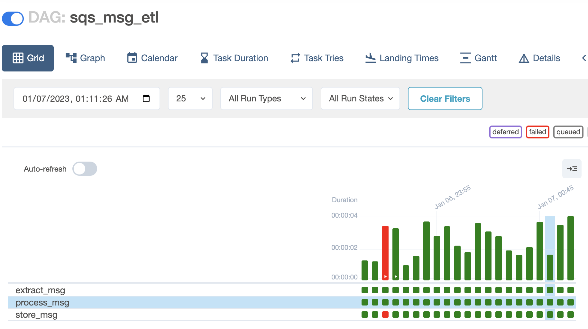

# ETL off a SQS Queue
The ETL off a SQS Queue implements the whole ETL process through Airflow. And it will lauch a new run every 5 minutes.
The ETL consists 3 steps: 
  - **Data Extraction**: use BashOperator to extract data through awscli-local from SQS
  - **Data Cleaning**: flattern nested Json data, convert to Pandas dataframe; mark PII and convert app version to integer; save the transformed data into csv file.
  - **Data Storage**: insert the csv file into Postgres.


## Table of contents
- Requirements
- Installation
- Maintenance
- Answer to Questions
## Requirements
This ETL requires the following modules:
- [Docker]
- [Docker Compose]

## Installation
1. Clone the repo, enter the directory in terminal and build the services
```
docker compose up -d
```
2. Make sure every service is healthy by checking:
```
docker compose ps
```
3. Move the `sqs_dag.py` in `/dags`;
4. In the Airflow dashboard (http://localhost:8080/, username: airflow, password: airflow), create the PostgreSQL connection at `Admin>Connections>ADD+`: 
  - Connection Id: postgres_sqs
  - Connection Type: Postgres
  - Host: postgres_sqs
  - Login: postgres
  - Password: postgres
  - Port: 5432  
  
5. Turn on the toggle of DAG: `sqs_msg_etl`. Refresh and a DAG runs will start and complete soon. 
   
6. Check the PostgresSQL if the data inserted:

  - enter the container and the postgres CLI
    ```
    docker exec -it airflow-postgres_sqs-1 /bin/bash
    psql -Upostgres
    ```
  - In postgres CLI, connect to database `postgres` and query on the table
    ```
    \c postgres
    SELECT * FROM user_logins LIMIT 10;
    ```
  


## Maintenance
In the Airflow dashboard (http://localhost:8080/), check `Grid` and `Calendar` for overview of runs' status, and check log for detialed process.



## Answer to Questions
  - **Q1. How would you deploy this application in production?**
 
    Launch Airflow workers on multi-node cluster (Kubernetes cluster) to surpport scale. Also, switch interaction with LocalStack to AWS.

  - **Q2. What other components would you want to add to make this production ready?**
    1. Additional handling for extracting no message from SQS (current implementation can handle the case, but not elegantly).
    2. Rebuilt the Airflow Worker image (current image doesn't include all the requires modules, they are installed at docker compose step, which is not suitable for production enviroment).
    3. Add alarm notification for task failures.

  - **Q3. How can this application scale with a growing dataset.**
 
    If the SQS has high throughput, ETL may increase workflow frequency, limit the number of message for each consumption, increase number of work nodes and transfer the database from Postgres to distributed cluster (Hadoop, Redis).

  - **Q4. How can PII be recovered later on?**
 
    Given that the ETL encrypt the PII through ECB and base64, the user can recover the PII through reversed process:
    ```
    def decypt_text(en_text):
        aes = AES.new(FETCH_TOKEN.encode("utf8"), AES.MODE_ECB)
        base64_decrypted = base64.decodebytes(en_text.encode(encoding='utf-8'))
        decrypted_text = str(aes.decrypt(base64_decrypted), encoding='utf-8').replace('\f', '')
        return decrypted_text
    ```
  - **Q5. What are the assumptions you made?**
  
    1. Assumed the LocalStack service is healthy, and the message contains necessary fields with specific name;
    2. Assumed the each message info size is limited, hence it will be suitable to transit between Airflow tasks.
    3. Assumed the version format follows sematic versioning, hence it will fits the implemented conversion method.
    
